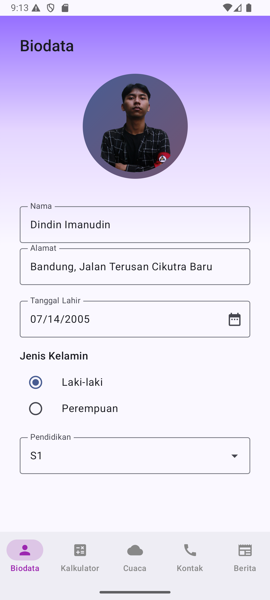
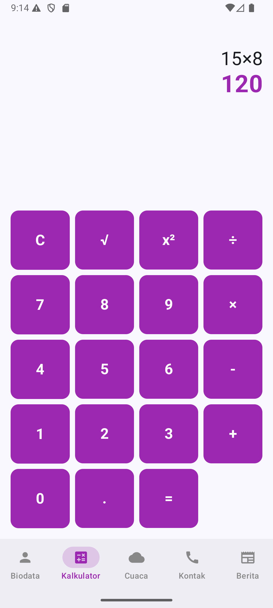
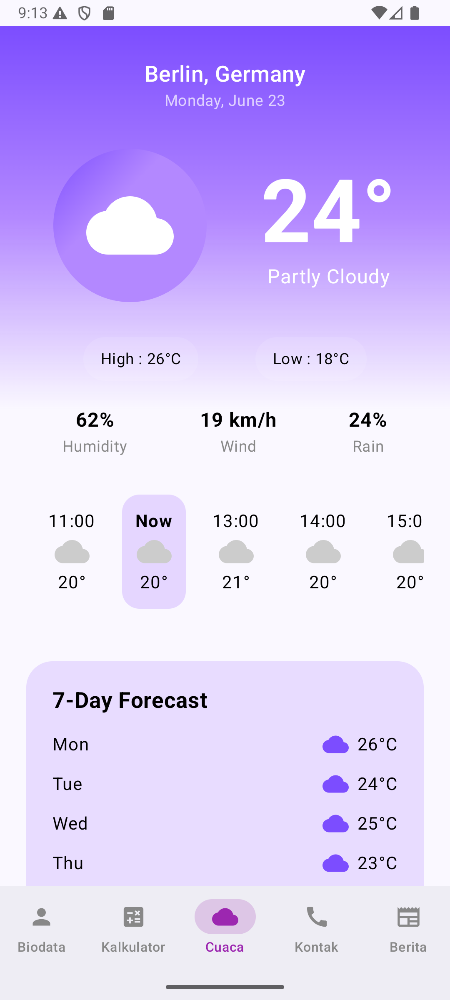
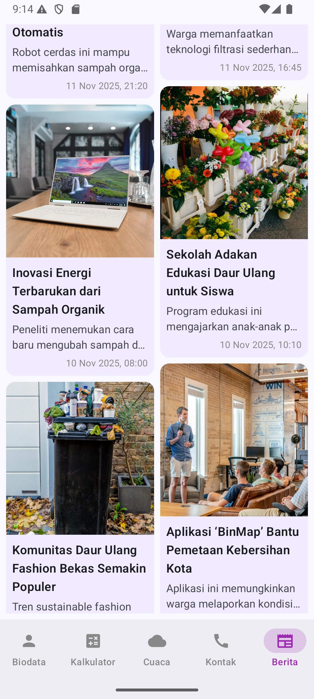

# Viora — Personal Weather & Info App

Viora adalah aplikasi mobile berbasis **Jetpack Compose** yang menggabungkan informasi cuaca, biodata pengguna, kalkulator sederhana, kontak, dan berita terkini dalam satu aplikasi yang elegan dengan tema ungu futuristik.

Aplikasi ini dikembangkan sebagai bagian dari proyek pengembangan aplikasi mobile dengan fokus pada desain UI/UX modern dan pemanfaatan data statis berbasis Compose.

---

## 🪄 Fitur Utama

| Fitur | Deskripsi |
|-------|------------|
| 🌤️ **Splash Screen** | Tampilan pembuka aplikasi dengan logo dan gradasi ungu lembut. |
| 👤 **Biodata Page** | Halaman untuk menampilkan biodata pengguna (nama, email, deskripsi singkat). |
| 🧮 **Kalkulator Page** | Kalkulator sederhana untuk perhitungan dasar dengan desain modern. |
| 🌦️ **Cuaca Page** | Menampilkan informasi cuaca terkini, suhu, kelembapan, angin, dan ramalan harian. |
| 📞 **Kontak Page** | Daftar kontak dengan fitur pencarian dan tombol menu pada tiap kontak. |
| 📰 **Berita Page** | Daftar berita terkini dengan gambar dan ringkasan singkat setiap artikel. |

---

## 📱 Tampilan Aplikasi (Screenshots)

| Halaman | Screenshot |
|----------|-------------|
| **Splash Screen** |  |
| **Biodata Page** |  |
| **Kalkulator Page** |  |
| **Cuaca Page** |  |
| **Kontak Page** |  |
| **Berita Page** |  |

> 💡 *Semua screenshot dapat ditemukan di folder `screenshots/` pada repository ini.*

---

## 🧩 Teknologi yang Digunakan

- **Kotlin**
- **Jetpack Compose**
- **Material 3 Design**
- **Navigation Compose**
- **LazyColumn & LazyRow** untuk list berita dan ramalan cuaca
- **State Management** menggunakan `remember` dan `mutableStateOf`

---

## 🧭 Navigasi Aplikasi

Aplikasi menggunakan **Bottom Navigation Bar** untuk berpindah antar halaman utama:
- `Biodata`
- `Kalkulator`
- `Cuaca`
- `Kontak`
- `Berita`

---

## 🧑‍💻 Pengembang
**Nama:** Dindin Imanudin  
**NIM:** 152023073 
**Prodi:** Informatika 
**Kampus:** Institut Teknologi Nasional Bandung

